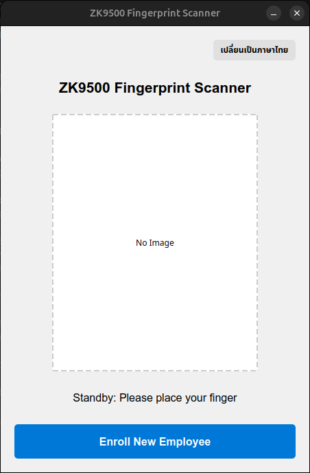
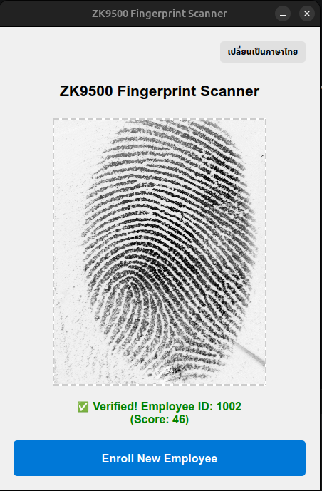

# ZKTeco ZK9500 Python USB Interface (Unofficial)

> ⚠️ **DISCLAIMER / IMPORTANT LEGAL NOTICE** ⚠️
> 
> This project is created strictly for **Educational and Research Purposes**. The developer is not affiliated with, endorsed by, or representing ZKTeco in any way.
> 
> **By using this project, you agree to assume all risks associated with its use. The developer shall NOT be held liable for any damages or consequences, including but not limited to:**
> * Legal actions, copyright infringement, or intellectual property disputes.
> * Hardware damage (e.g., bricked devices, broken sensors).
> * Leaks of personal/biometric data or system security breaches.
> * Business losses or any other damages arising from the use of this software.
> 
> This software is provided "AS IS", without warranty of any kind. If you do not agree to these terms, **DO NOT use this software.**

---

## 📌 About The Project
This project is an unofficial Python script developed through USB Traffic Analysis (Reverse Engineering) of the **ZKTeco ZK9500** fingerprint scanner. It allows you to connect, control, and extract raw fingerprint image data directly from the sensor using the `pyusb` library, **without needing the official manufacturer's SDK or drivers**.

## 📸 Screenshots (demo)
 

## ✨ Features
* 🔌 **Direct USB Communication:** Interacts directly with the hardware via USB Bulk/Control Transfers.
* 📸 **Auto-Detect Image Format:** Automatically captures and converts raw fingerprint data into `.png` images, supporting 2 hardware modes:
  * **Cropped Mode (112.5 KB):** 300x375 resolution (Hardware-cropped fingerprint image).
  * **Full Frame Mode (1.9 MB):** 1600x1200 resolution (Raw, full-frame CMOS sensor image).
* 🐧 **Cross-Platform:** Works on Linux and other operating systems that support Python and `libusb`.

## 🛠️ Prerequisites
* Python 3.x
* `pyusb` (for USB communication)
* `Pillow` (for converting Raw images to PNG)

Install the required dependencies:
```bash
pip install pyusb Pillow
```

## 🎯 Feature Checklist / Roadmap

**Hardware Communication (USB Layer)**
- [x] USB Device Discovery and Connection
- [x] Kernel Driver Detachment & Interface Claiming
- [x] Hardware Handshake & Initialization
- [x] Finger Presence Detection (Polling)
- [x] Hardware Reset & Clean Disconnection

**Image Capture & Processing**
- [x] Capture Full Frame Raw Image (1600x1200)
- [x] Capture Hardware-Cropped Image (300x375 via Magic Sequence)
- [x] Auto-detect Image Size and Convert RAW to PNG (`Pillow`)
- [x] Fingerprint Template Extraction (Minutiae points via `nbis-py` & ISO 19794-2 standard)

**Data Storage & Advanced Integration**
- [x] Local Template Database (SQLite with 1-to-Many dynamic enrollment)
- [x] 1:1 Fingerprint Verification (Matching)
- [x] 1:N Fingerprint Identification (Ultra-fast RAM Caching & Early-Exit)
- [x] Continuous Standby Mode (Background Threading for live scanning)
- [x] Simple GUI Dashboard for Live Preview